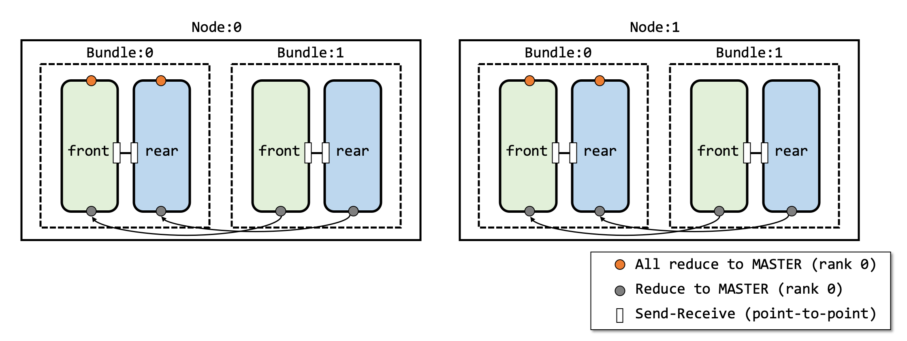

# Hybrid Parallelism Example

This repository contains example code for Bundle-based Hybrid Parallelism.
How to split the model should be defined under `model.py` with its model name.

----
### Hybrid Parallelism




By default, bundle works with two sub-models: front and rear model. 
Each model runs on one GPU and they communicate each other via CPU.
It is possible to run several bundles on one server (unless enough GPUs are installed in the server).
Then, a bundle with rank 0 (i.e., local MASTER) collects all gradients in every synchronization step.
All local MASTER use all-reduce to synchronize all gradients among them.
For more detail, please refer to paper.

----

### How to execute

This code supports ...  
 - Hybrid parallelism 
 - Data parallelism
 - Model parallelism
 
By default, the code supports to execute split model with hybrid parallelism.
Following its definition, model parallelism with two workers is easily implemented using the code.
 
#### Running with Code

##### Prepare running environment
- python 3
- pytorch
- CUDA
- termcolor `pip install termcolor`

```bash
git clone https://github.com/EunjuYang/Bundle_HybridParallelism.git
```
##### Running  the program
###### Hybrid Parallelism with Bundle

The code provides 

```bash
 python main.py \
        --batch-size = {batch size for one bundle} 
        --rank = {rank of this node} \
        --itr = {number of iteration you run} \
        --bundle-shape = {shape of bundle, e.g., 1,1 or 4,2 etc.}\
        --num-bundle = {number of bundles runnning in this cluster}\
        --IP = {IP address of master node}\
        --portNum = {portnumber of master node}\
        --model = {model name - partitioned model name}\
        --world-size = {the number of total nodes running in this cluster}\
        {PATH for ImageNet Data DIR}\
```

Here, 
`--num-bundle` option gets the number of bundles running on the designated node.
`--world-size` denotes the number of servers which are interconnected each other.
`--bundle-shape` denotes the shape of bundle (We only support partitioned in two parts, i.e. front & rear)

###### Pure data Parallelism

The code provides `--DP-ONLY` option. 
If you type the flag, then it means you will run the code only using data parallelism.
Then, `--num-hp` flag will only get the value of the number of workers used for data parallelism.

```bash
python main.py \
        --batch-size = 32 \
        --rank = {rank of this node} \
        --num-hp = {number of workers for data parallelism} \
        --IP = {IP_address_for_MASTER} \
        --modela = resnet101 \
        --world-size = {number of inter-DP servers} \
        --DP-ONLY \
        ~/Downloads/ImageNet/
```

----

#### Running with Docker 

##### Pre-Requisites

- Docker
- Nvidia-Docker or [Accelerator-Docker](https://github.com/KAIST-NCL/Accelerator-Docker.git) to support running containers with GPUs

    ```bash
    $ curl -s -L https://nvidia.github.io/nvidia-docker/gpgkey | sudo apt-key add -
    $ distribution=$(. /etc/os-release;echo $ID$VERSION_ID)
    $ curl -s -L https://nvidia.github.io/nvidia-docker/$distribution/nvidia-docker.list | sudo tee /etc/apt/sources.list.d/nvidia-docker.list
    $ sudo apt-get update
    $ sudo apt-get install -y nvidia-docker2
    ```
 - Compose container cluster with swarm to support creating overlay network.
    ```bash
    (master)$ docker swarm init
    (worker)$ docker swarm join --token <your_token> <your_ip_address>:2377
    ```

##### Compile container image
```bash
docker build -t yejyang/bundlehp:v01 ./
```

##### Run the bundle container with the script file

Passing parameters as arguments (script runs with NVIDIA-Docker)
```bash
$ chmod 777 run-bundle-hp.sh
$ ./run-bundle-hp.sh [batch_size] [rank] [shape] [num_bundle] [IP] [portNum] [world_size] [model] [data_path-absolute path] [itr]
``` 
for example, `./run-bundle-hp.sh 32 1 4,2 1 2 resnet101_trial4 /home/yejyang/Downloads/ImageNet 2` means 
"run `one` bundle shape of `[4,2]` over `two` worker with `resnet101_trial4` model, where this node has rank 1.

Or just running shell script to get some helps.
```bash
$ ./run-bundle-hp.sh 
``` 
